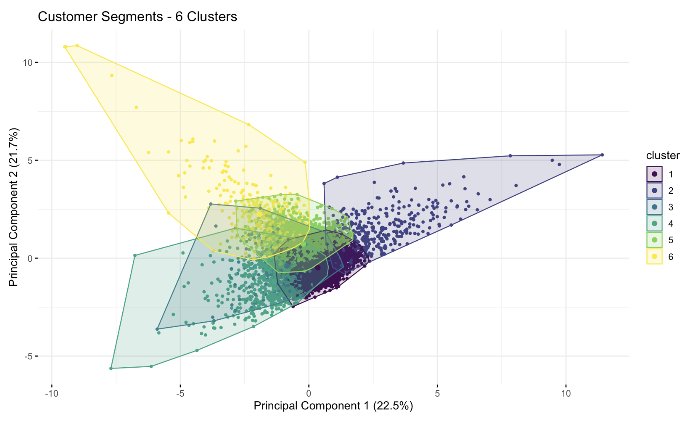
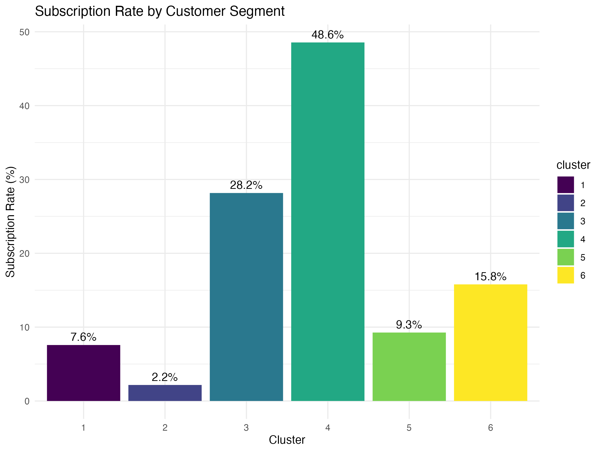

# Bank Customer Segmentation Analysis

## Project Overview
This project analyzes banking marketing data to identify distinct customer segments and their propensity to subscribe to term deposit products. Using K-means clustering and other advanced techniques, I discovered 6 distinct customer segments with subscription rates ranging from 2.2% to 48.6%.

## Key Findings
- **High-Value Segments**: Two small segments (11.2% of customers) generated 38.1% of all subscriptions
- **Conversion Rate Disparity**: 22x difference between best and worst-performing segments
- **Efficiency Insight**: Call duration is more predictive of success than contact frequency
- **Strategic Direction**: Developed segment-specific marketing strategies for optimization

## Data
The analysis uses the Bank Marketing dataset from UCI Machine Learning Repository, containing information from direct marketing campaigns of a Portuguese banking institution. The dataset includes customer demographics, financial information, and campaign interaction details.

## Techniques Applied
- Customer segmentation using K-means clustering
- Dimensionality reduction with Principal Component Analysis (PCA)
- Comparison with Gaussian Mixture Models (GMM)
- Feature importance analysis
- Marketing efficiency metrics

## Customer Segments Identified

| Segment | Profile | Conversion Rate | Key Characteristics |
|---------|---------|-----------------|---------------------|
| 1 | Mass Market Customers | 7.6% | Largest segment (50.4%), middle-aged (33.8 years), low balances (790€) |
| 2 | Marketing Resistant Group | 2.2% | High contact frequency (16.1 campaigns), brief calls, minimal interest |
| 3 | Engaged Mid-Value Clients | 28.2% | Middle-aged (41.5 years), above-average balances (1,265€) |
| 4 | High Conversion Segment | 48.6% | Extremely long call durations (913s), moderate balances |
| 5 | Senior Conservative Customers | 9.3% | Oldest group (52.3 years), standard engagement patterns |
| 6 | Affluent Clients | 15.8% | High balances (12,199€), management positions |

## Tools Used
- R for data analysis and visualization
- tidyverse, cluster, factoextra, and other R packages
- R Markdown for reproducible reporting

## Author
Jordy Alfaro, Data Scientist
